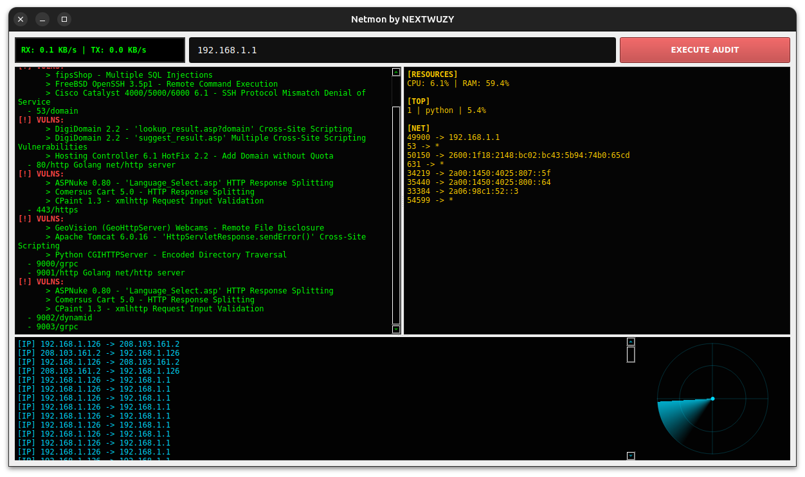

Netmon by NEXTWUZY is a professional-grade network analysis suite. It combines a real-time traffic sniffer, an automated security auditor, and an offline-first exploit database. Designed with a custom tactical UI and fully containerized via Docker, it ensures seamless deployment and performance in any environment without host system dependencies.

Live Traffic Sniffer: Real-time IP packet interception (TCP/UDP).

Security Auditor: Rapid host scanning and OS fingerprinting.

Offline Exploit-DB: Integrated, self-updating local exploit database for air-gapped environments.

System Resources Monitor: Live CPU/RAM and active network connection tracking.

Dockerized GUI: Seamless X11-forwarding for consistent UI rendering across different Linux distributions.

## 📦 Quick Start
1. Clone the repo:
   `git clone https://github.com/nextwuzy-cyber/NETMON-v1.git`
2. Run the tactical suite:
   `chmod +x run_docker.sh && ./run_docker.sh`

## ⚠️ Disclaimer (Educational Purposes)
This tool is created strictly for **educational and ethical security testing purposes only**. The author (nextwuzy-cyber) is not responsible for any misuse or damage caused by this software. Use it only on networks you own or have explicit permission to test.
